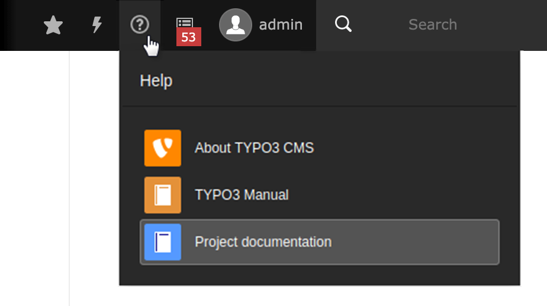
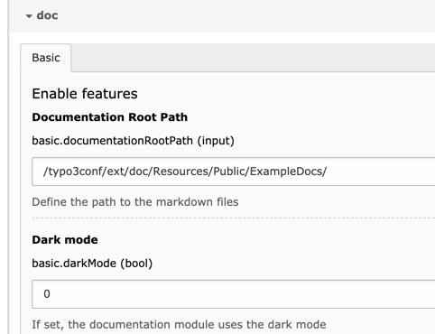

# TYPO3 Extension `doc`

This extension adds an option to the *Help* menu called *Project Documentation*, that lets you deliver documentation about your project from within TYPO3 CMS backend.

It is based on Markdown. This makes it easy to write documentation while you're building a custom extension, 
or afterward. You could include descriptions of content elements, release notes, instructions for raising issues
or anything else that needs to be documented.

The JS library [docsify](https://docsify.js.org/) transforms **markdown files** into beautiful HTML content.

## Setup the extension

Download the extension. Use one of the following options:

1. *Composer*: `composer req georgringer/doc`
2. *TER*: Download extension from [TER](https://extensions.typo3.org/extension/doc/)
3. *TYPO3 Backend*: Download extension in *Extension Manager*

### Configuration

Switch to **Install Tool/Settings** and customize the global configuration.
As seen in the screenshot below, the following configuration options are available:

* `Documentation Root Path`: Define the path to the Markdown files
* `Documentation Name`: Documentation name as it appears in the sidebar
* `Dark mode`: Enable the dark mode

## Write the documentation

> Without any documentation, this extension is not useful at all :)

Check out the sample documentation included in this extension which you can use as a guide `EXT:doc/Resources/Private/ExampleDocs`.
See also the [Markdown Cheatsheet](Resources/Private/ExampleDocs/Setup/Markdown.md) as there are some nice features available.

When you create your own documentation make sure to put the folder with your markdown files in `Resources/Private`. Otherwise your markdown files may be publicly accessible.
